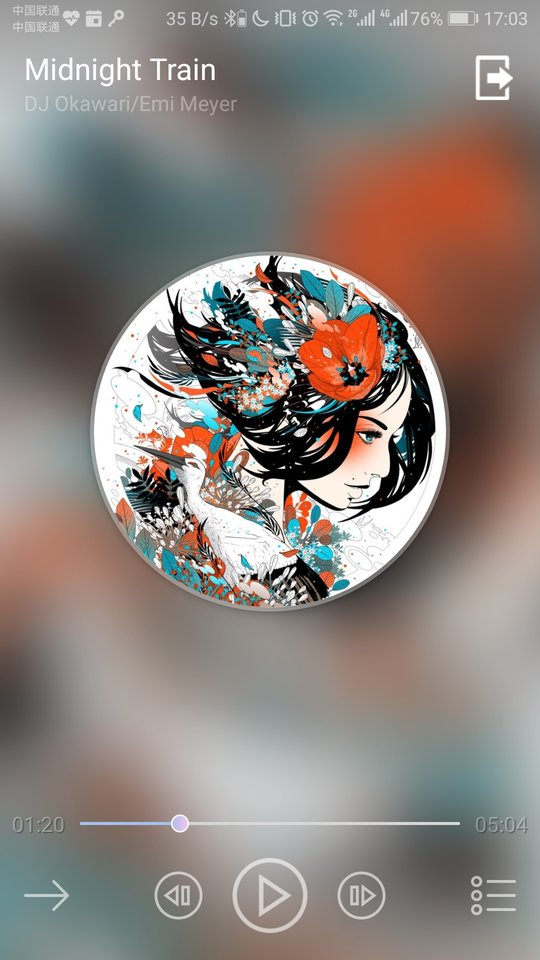

# TuneHome

TuneHome 是一个美观、轻量的 Android 音乐播放器，支持播放列表、后台播放、蓝牙线控和手势操作~基于 Android 8.0 (API 26) 构建，且最低支持的 SDK 版本为 API 23。

## 效果预览

播放时效果：

支持播放列表：

可切换不同的显示风格：

## 使用指南

### 添加音乐、播放音乐

在进入界面后，右下角按钮为播放列表，点击后可以进入播放列表，之后可以点击加号进行歌曲选择，然后即可点击列表中音乐来播放了。

### 回放控制：播放、暂停、停止、上一首、下一首

点击播放按钮即可播放，点击暂停按钮即可暂停播放，长按暂停按钮则可以停止音乐。点击左侧圆形按钮可以播放上一首音乐，点击右侧圆形按钮可以播放下一首音乐。在空白处向左滑可以到下一首音乐，右滑则可以切换到上一首。

### 切换播放模式和显示风格

点击左下角按钮可以在三种顺序模式间切换，点击专辑图片可以在两种显示风格间切换。

## 更新日志

### Version 0.1

- 完成 UI 设计与实现
- 完成逻辑设计与实现
- 支持手势操作
- 支持蓝牙耳机和线控耳机的按键控制
  - 仅限 Android 8.0+
  - 在搭载 EMUI 8.0 的 HUAWEI P9 Plus 上搭配 Sony 1000XM3 通过测试

### Version 0.2

- 支持一键导入媒体库
- 支持播放列表清空和歌曲删除操作
- 更换了系统控件 UI